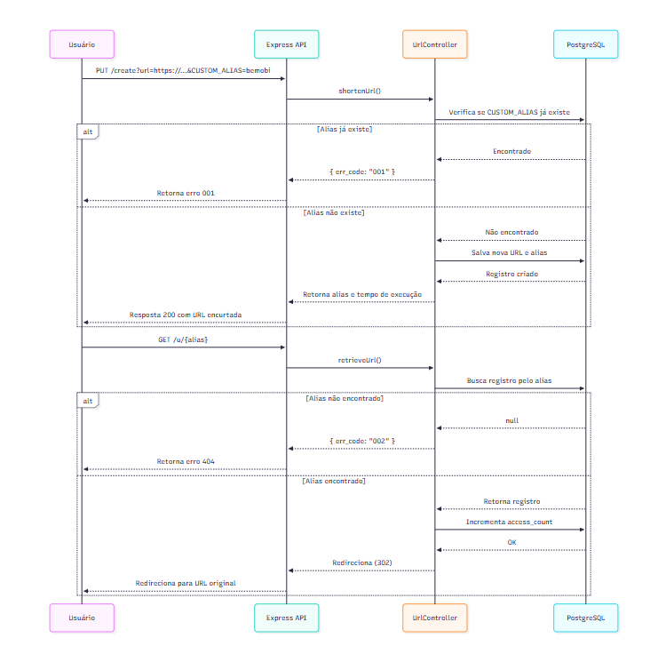

# URL Shortener API

API simples de encurtamento de URLs desenvolvida como parte de um desafio técnico.  
O projeto demonstra boas práticas de design de soluções, uso de ORM (TypeORM), integração com banco de dados PostgreSQL e documentação automática via Swagger.

---

## Funcionalidades

A aplicação implementa dois casos de uso principais:

1. **Shorten URL** — Encurtar uma URL e gerar um alias único.
2. **Retrieve URL** — Recuperar/redirecionar uma URL original a partir do alias encurtado.

Além disso:

- Permite criar um alias customizado (`CUSTOM_ALIAS`);
- Retorna erros padronizados conforme regras do desafio;
- Armazena e contabiliza acessos no banco de dados;
- Fornece endpoint para listar o **Top 10 URLs mais acessadas**;
- Documentação via Swagger em `/docs`.

---

## Tecnologias Utilizadas

| Tecnologia                                       | Uso                                    |
| ------------------------------------------------ | -------------------------------------- |
| **Node.js + Express**                            | Servidor da API                        |
| **TypeORM**                                      | Mapeamento objeto-relacional           |
| **PostgreSQL**                                   | Banco de dados                         |
| **Swagger (swagger-ui-express + swagger-jsdoc)** | Documentação da API                    |
| **dotenv**                                       | Gerenciamento de variáveis de ambiente |
| **CORS**                                         | Liberação de acesso externo seguro     |

---

## Estrutura de Pastas

```
src/
├── config/
│ └── data-source.ts
├── controllers/
│ └── urlController.ts
├── entities/
│ └── Url.ts
├── routes/
│ └── urlRoutes.ts
├── docs/
│ └── swaggerDocs.ts
├── app.ts
├── server.ts
```

## Casos de Uso

### Shorten URL (`PUT /create`)

O usuário envia a URL que deseja encurtar e, opcionalmente, um `CUSTOM_ALIAS`.

#### Exemplos

**Sem alias customizado**

```bash
PUT http://localhost:3000/create?url=https://www.bemobi.com.br

{
  "alias": "XYhakR",
  "url": "http://localhost:3000/u/XYhakR",
  "statistics": { "time_taken": "10ms" }
}

```

**Com alias customizado**

```

PUT http://localhost:3000/create?url=https://www.bemobi.com.br&CUSTOM_ALIAS=bemobi

{
  "alias": "bemobi",
  "url": "http://localhost:3000/u/bemobi",
  "statistics": { "time_taken": "12ms" }
}

```

**Alias já existente**

```

PUT http://localhost:3000/create?url=https://www.github.com&CUSTOM_ALIAS=bemobi

{
  "alias": "bemobi",
  "err_code": "001",
  "description": "CUSTOM ALIAS ALREADY EXISTS"
}

```

### 2 - Retrieve URL (`GET /u/:alias`)

O usuário acessa o endpoint passando o alias.
Caso exista, ele é redirecionado automaticamente para a URL original.
Se não existir, é retornado o erro:

```

{
  "err_code": "002",
  "description": "SHORTENED URL NOT FOUND",
  "statistics": { "time_taken": "0ms" }
}

```

### 3 - Top URLs (`GET /top`)

Retorna as 10 URLs mais acessadas:

```

[
  {
    "original_url": "https://www.bemobi.com.br",
    "total_access_count": 42
  },
  {
    "original_url": "https://github.com",
    "total_access_count": 25
  }
]


```

## Diagramas de Sequência



## Geração de Alias Aleatório

Math.random().toString(36).substring(2, 8);

## Testes Rápidos via Curl

```
# Criar URL encurtada
curl -X PUT "http://localhost:3000/create?url=https://www.bemobi.com.br"

# Criar com alias customizado
curl -X PUT "http://localhost:3000/create?url=https://www.bemobi.com.br&CUSTOM_ALIAS=bemobi"

# Recuperar URL
curl -X GET "http://localhost:3000/u/bemobi"

# Listar top 10
curl -X GET "http://localhost:3000/top"


```

## Executando o Projeto

```
# Instalar dependências
npm install

# Criar arquivo .env com suas variáveis:
DB_HOST=localhost
DB_PORT=5432
DB_USER=postgres
DB_PASSWORD=admin
DB_NAME=urlshortener

# Rodar servidor
npm run dev

```

API disponível em http://localhost:3000
Swagger UI: http://localhost:3000/docs
